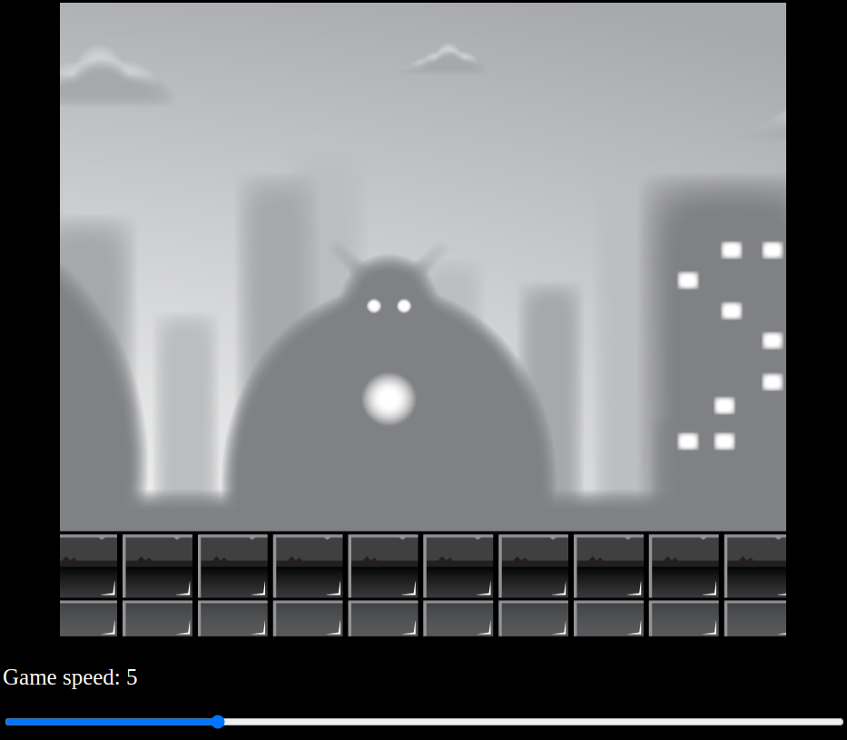

# Parallax-in-javascript-games-training
** Use CTRL/CLIC or **Middle mouse button** for BLANK TAB **
  
[Result here](https://henriteinturier.github.io/Parallax-in-javascript-games-training/)
 
### learning in this training:
* Canvas HTML
* Class + constructor for instance of each layer for parallax scrolling
* getContext('2d')
* drawImage
* requestAnimationsFrame
* forEach
* technique to manage animation speed
 

